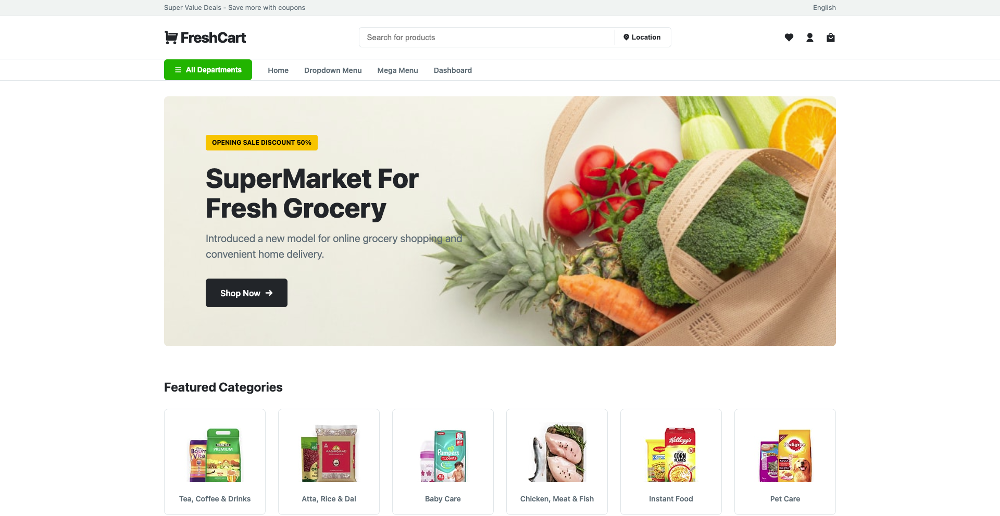

# FreshCart Project

This project is a web design implementation inspired by a modern e-commerce interface. It demonstrates a clean, responsive layout suitable for an online grocery store or supermarket.

## About This Project

This webpage was designed to provide a user-friendly shopping experience. It features a structured layout that includes:
-   **Navigation Bar**: Easy access to different sections, search functionality, and user account options.
-   **Hero Banner**: A prominent section to highlight current offers and welcome visitors.
-   **Featured Categories**: A clear visual grid that allows users to quickly browse through different product types like Fruits, Vegetables, and Bakery items.

The design focuses on simplicity and visual appeal, ensuring that key information is easily accessible.

## Technologies Used

-   **HTML5**: Semantic structure.
-   **CSS3**: Custom properties (Variables), Grid, Flexbox, Media Queries.
-   **RemixIcon**: For UI icons.

## How to Run

1.  Clone this repository.
2.  Open `index.html` in your web browser.
